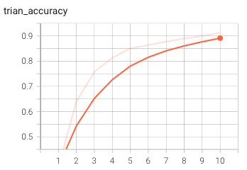

# CIFAR10 Classification

This article introduces the use of convolutional neural networks to classify the CIFAR10 data set. Click [CIFAR](https://www.cs.toronto.edu/~kriz/cifar-10-python.tar.gz) to download the data set . Finally, several sets of experiments were done to observe the influence of hyperparameters on training results.

## 1 Introduction

This article uses convolutional neural network to classify CIFAR10 images, adjusts the effect of hyperparameter observation model, and visualizes the experimental results. CIFAR-10 is a small data set used to identify universal objects. It contains 10 categories of RGB color pictures.

The data set has a total of 60,000 color images, these images are 32*32, divided into 10 categories, each category has 6000 images. There are 50,000 images used for training, forming 5 training batches, each batch of 10,000 images; the other 10,000 are used for testing, forming a single batch. In the data of the test batch, it is taken from each of the 10 categories, and 1000 pieces of each category are randomly selected. The rest is randomly arranged to form a training batch. Note that the number of images in a training batch is not necessarily the same. Looking at the training batch in general, there are 5000 images in each category.


## 2 Installation

### Requirements

- Python=3.8
- Numpy
-  torch==1.7.0
- torchaudio==0.7.0a0+ac17b
- torchvision==0.8.0
- tqdm==4.62.3

### Pytorch

```python
git clone --recursive https://github.com/pytorch/pytorch
```

### Build project

```python
python ImageClassification.py
```

## 3 build a CNN 

### 3.1 Data processing

After downloading, place it in the data folder, or you can use your own data set.

**Data preprocessing process**：

- create transforms，transforms.Compose() can pass in a list, which is an instance of data-enhanced classes, transforms.Compose() can combine these data-enhanced classes to reduce the amount of code.
- use torch.datasets.CIFAR10 to load the dataset for augmentation.

```python
train_transform = transforms.Compose([transforms.RandomHorizontalFlip(), transforms.ToTensor()])
test_transform = transforms.Compose([transforms.ToTensor()])
train_set = torchvision.datasets.CIFAR10(root='./data', train=True, download=True, transform=train_transform)
train_loader = torch.utils.data.DataLoader(dataset=train_set, batch_size=64, shuffle=True)
test_set = torchvision.datasets.CIFAR10(root='./data', train=False, download=True, transform=test_transform)
test_loader = torch.utils.data.DataLoader(dataset=test_set, batch_size=64, shuffle=False)
```

### 3.2 build network

Build a convolutional neural network model, this network is used to extract the features of the picture, and then connect the extracted features to 10 neurons, which is divided into 10 categories.

```python
cfg = {
    'model': [64, 64, 'M', 128, 128, 'M', 256, 256, 256, 'M', 512, 512, 512, 'M', 512, 512, 512, 'M'],
}
class VGG(nn.Module):
    def __init__(self, vgg_name):
        super(VGG, self).__init__()
        self.features = self._make_layers(cfg[vgg_name])
        self.classifier = nn.Linear(512, 10)

    def forward(self, x):
        out = self.features(x)
        out = out.view(out.size(0), -1)
        out = self.classifier(out)
        return out

    def _make_layers(self, cfg):
        layers = []
        in_channels = 3
        for x in cfg:
            if x == 'M':
                layers += [nn.MaxPool2d(kernel_size=2, stride=2)]
            else:
                layers += [nn.Conv2d(in_channels, x, kernel_size=3, padding=1),
                           nn.BatchNorm2d(x),
                           nn.ReLU(inplace=True)]
                in_channels = x
        layers += [nn.AvgPool2d(kernel_size=1, stride=1)]
        return nn.Sequential(*layers)
```

### 3.3 train

Init.

```
model = VGG('VGG16').to(torch.device('cuda'))
device = torch.device('cuda')
optimizer = optim.Adam(model.parameters(), lr=0.001)
scheduler = optim.lr_scheduler.MultiStepLR(optimizer, milestones=[75, 150], gamma=0.5)
criterion = nn.CrossEntropyLoss().to(device)
```

Save model.

```
torch.save(model, 'model.pkl')
```

Complete training code.

```python
def train():
    train_los = []
    test_los = []
    epochs = 100
    for epoch in range(1, epochs + 1):
        scheduler.step(epoch)
        print("\n===> epoch: %d/100" % epoch)
        model.train()
        train_loss = 0
        train_correct = 0
        total = 0
        for batch_num, (data, target) in enumerate(train_loader):
            data, target = data.to(device), target.to(device)
            optimizer.zero_grad()
            output = model(data)
            loss = criterion(output, target)
            loss.backward()
            optimizer.step()
            train_loss += loss.item()
            prediction = torch.max(output, 1)  # second param "1" represents the dimension to be reduced
            total += target.size(0)
            # train_correct incremented by one if predicted right
            train_correct += np.sum(prediction[1].cpu().numpy() == target.cpu().numpy())
        train_result,_ = train_loss, train_correct / total

        train_los.append(train_result)
        torch.save(model, 'model.pkl')
        print("test:")

        model.eval()
        test_loss = 0
        test_correct = 0
        total = 0
        with torch.no_grad():
            for batch_num, (data, target) in enumerate(test_loader):
                data, target = data.to(device), target.to(device)
                output = model(data)
                loss = criterion(output, target)
                test_loss += loss.item()
                prediction = torch.max(output, 1)
                total += target.size(0)
                test_correct += np.sum(prediction[1].cpu().numpy() == target.cpu().numpy())
        test_result =  test_loss, test_correct / total
        test_los.append(test_result)
        #drow loss
        plt.figure(1)
        plt.subplot(211)
        plt.plot(train_los)
        plt.subplot(212)
        plt.plot(test_los)
        plt.show()

```

### 3.4 Test

```python
def test(min_num_image,max_num_image):
    to_pil_image = transforms.ToPILImage()
    cnt = 0
    for image,label in test_loader:
      if cnt<min_num_image or cnt>max_num_image:
            break
      print("label",label)
      out = (model(image.to(device)))
      prediction = torch.max(out, 1)
      print("prediction",prediction[1])
      img = to_pil_image(image[0])
      img.show()
      plt.imshow(img)
      plt.show()
      cnt+=1
```


## 3.5 Visualize

- using tensor board to visualize the results

```bash
tensorboard --logdir=logs
```


- using wandb to visualize the results


## 4 Experiments

### 4.1 adjust epochs

Epochs: 10

|  |  |
| ------------------------------------------------------------ | ------------------------------------------------------------ |

Epochs: 100

|  |  |
| ------------------------------------------------------------ | ------------------------------------------------------------ |

The epochs are too small and insufficient iteration on the training set will lead to underfitting, that is, the model does not work well on the training set.

### 4.2 adjust learning rate 


- Fluent-wave-10: Appropriate learning rate
- Logical-microwave-9， restfulserenty-8: Learning rate is too high

The learning rate determines the step size of the weight iterations and is therefore a very sensitive parameter, which affects the model performance in two ways, the first being the size of the initial learning rate and the second being the transformation scheme of the learning rate.

The experimental results are shown in the figure. It can be seen that if the initial learning rate is too large, it will cause the training to converge slowly, or even lead to failure to converge. This may be because the learning rate is too large, causing the local pole to be skipped during the iteration. Small value point, or oscillating near the local minimum point.


### 4.3 adjust Batch size

- **online learning**：The error surface of a linear neuron in the mean square error cost function is a paraboloid with an elliptical cross section. For multilayer neurons, nonlinear networks, the local approximation is still parabolic. Using online learning, each correction direction is corrected in the direction of the gradient of the respective sample, and i**t is difficult to achieve convergence by ramparting each other**.


- **the benefits of increasing Batch_Size** 
  - Memory utilization is improved, and parallelization of large matrix multiplication is made more efficient.
  - The number of iterations required to run through an epoch (full data set) is reduced, and the processing speed for the same amount of data is further accelerated.
  - Within a certain range, in general the larger the Batch_Size, the more accurate its determination of the direction of descent and the less training oscillation it causes.
- the benefits of 

### 4.4 dropout


After using dropout, the loss of the model on the training set drops relatively slowly, and the loss value on the training set will eventually be larger. Generally speaking, the performance of the two on the test set and training set is basically the same. It may be because the number of samples in the CIFAR10 data set is relatively large, and the difference between the test set and the training set and the test set is small, so dropout does not reflect its role.


### 6. weight_decay of Regularization

In the loss function, the weight decay is a coefficient placed in front of the regularization term (regularization). The regularization term generally indicates the complexity of the model, so the role of the weight decay is to regulate the effect of model complexity on the loss function, and if the weight decay is large, the value of the loss function of the complex model is also large.

It can be seen from the experimental results that weight_decay has a great influence on the effect of the model, and an unreasonable setting will lead to an unreasonable loss function, resulting in poor model effect.

